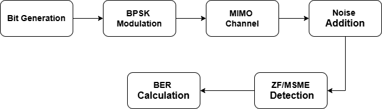
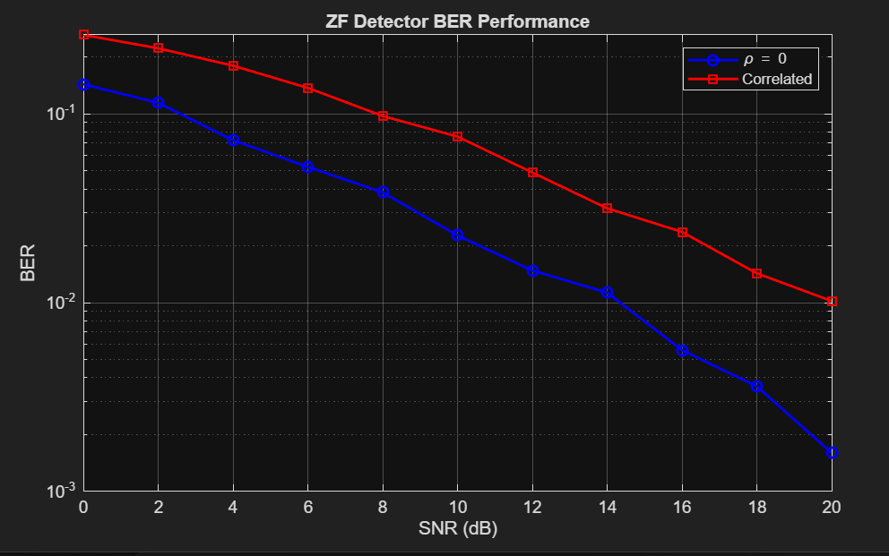
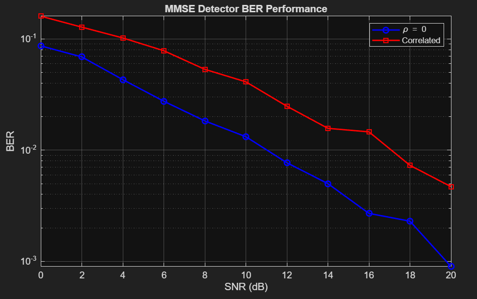
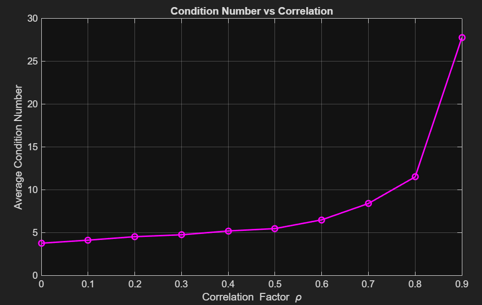
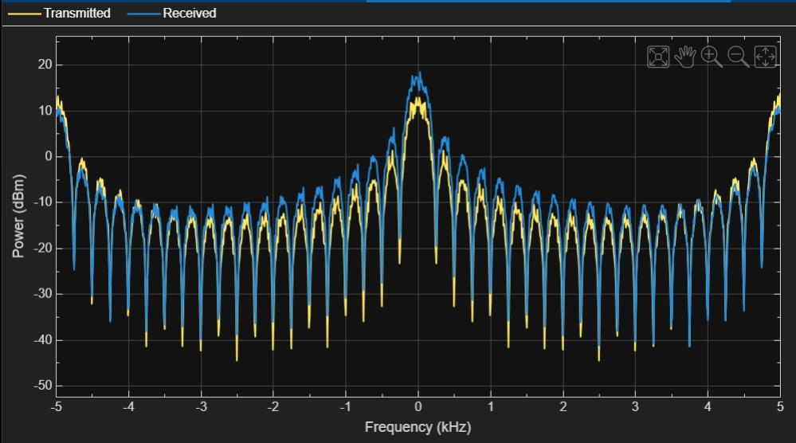
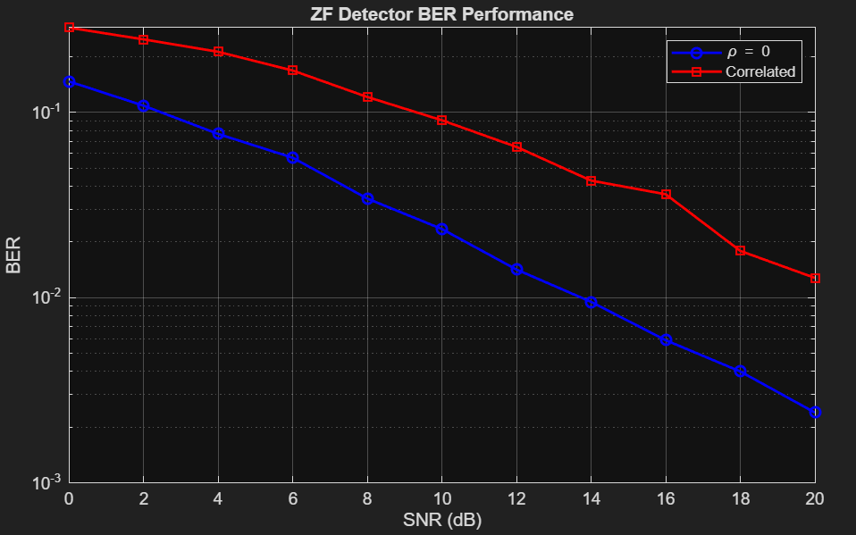
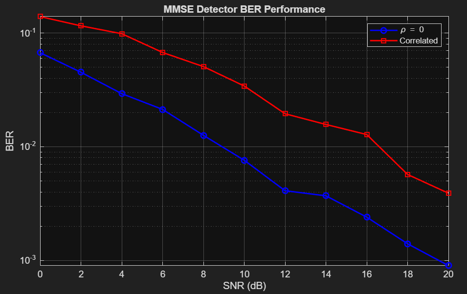
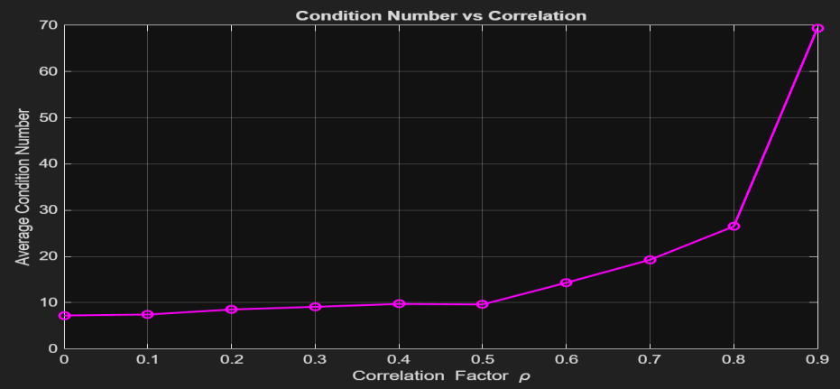
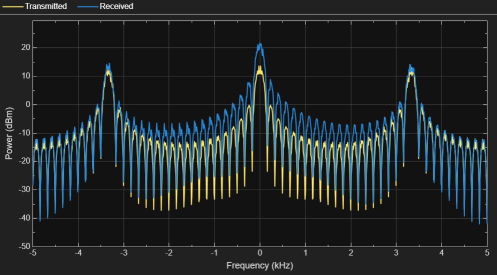

# Impact of Antenna Configuration on BER Performance in MIMO Systems

[](https://github.com/<your-username>/mimo-ber-antenna-configuration/actions/workflows/tests.yml)
[](https://www.mathworks.com/products/matlab.html)
[](LICENSE)

A MATLAB simulation study of how **antenna configuration** and **spatial correlation** affect the
**Bit Error Rate (BER)** of a MIMO link, and how **Zero Forcing (ZF)** and **MMSE** detectors cope with it.

> Project-Based Learning report for *Digital Signal Processing (22EC104009)*, B.Tech ECE (VI Sem),
> School of Engineering, **Mohan Babu University**, Tirupati — AY 2025-26.
> Full write-up: [`docs/PBL_Report.pdf`](docs/PBL_Report.pdf)

---

## Table of contents

- [Overview](#overview)
- [Features](#features)
- [Repository structure](#repository-structure)
- [Getting started](#getting-started)
- [Simulation model](#simulation-model)
- [Results](#results)
- [Key findings](#key-findings)
- [Limitations and notes](#limitations-and-notes)
- [Future work](#future-work)
- [Testing](#testing)
- [Team](#team)
- [License](#license)

## Overview

MIMO uses multiple antennas at both ends of a link to boost data rate and reliability. In practice, antennas
sit close together, so their channels become **correlated**, the channel matrix becomes ill-conditioned, and
detection gets harder. This project quantifies that effect.

For **2×2** and **3×3** systems we sweep SNR from 0 to 20 dB, compare an ideal channel (ρ = 0) with a
correlated one (ρ = 0.7 in the report, any 0 ≤ ρ < 1 supported), compare **ZF vs MMSE**, and track the
**condition number** of the channel matrix as ρ goes from 0 to 0.9.

## Features

- Flat **Rayleigh fading** MIMO channel with **Kronecker / Toeplitz** transmit and receive correlation
- **BPSK** spatial multiplexing, arbitrary `Nt × Nr`
- **ZF** and **MMSE** linear detectors (modular, individually testable)
- **BER vs SNR** curves for ideal vs correlated channels (log scale)
- **Condition number vs correlation** study
- Optional **Tx vs Rx spectrum** view (`spectrumAnalyzer`)
- Interactive entry point (as in the report) **and** a scriptable function API with a reproducible `Seed`
- Self-checking test suite and CI workflow

## Repository structure

```text
mimo-ber-antenna-configuration/
├── main.m                      # Interactive entry point (prompts for Nt, Nr, detector, rho)
├── src/
│   ├── run_mimo_ber.m          # Main simulation: BER vs SNR + condition number + plots
│   ├── correlation_factors.m   # Toeplitz correlation matrices and their square roots
│   ├── generate_channel.m      # Correlated Rayleigh channel realisation
│   ├── detect_zf.m             # Zero Forcing detector
│   ├── detect_mmse.m           # MMSE detector
│   └── avg_condition_number.m  # Mean cond(H) vs rho
├── examples/
│   ├── run_2x2.m               # Reproduce the 2x2 results of the report
│   ├── run_3x3.m               # Reproduce the 3x3 results of the report
│   └── sweep_correlation.m     # Bonus: BER vs rho at fixed SNR
├── tests/
│   └── run_tests.m             # Lightweight self-checks
├── results/
│   └── figures/                # Figures from the report (2x2/ and 3x3/)
├── docs/
│   ├── PBL_Report.pdf          # Full project report
│   ├── theory.md               # System model and maths
│   └── block_diagram.png
├── .github/workflows/tests.yml # CI (MATLAB)
├── CONTRIBUTING.md
└── LICENSE
```

## Getting started

### Requirements

| Need | Version |
| --- | --- |
| MATLAB | R2019b or newer (core MATLAB is enough for BER + condition number) |
| DSP System Toolbox | *Optional*, only for the Tx/Rx spectrum plot (`spectrumAnalyzer`) |

### Clone

```bash
git clone https://github.com/<your-username>/mimo-ber-antenna-configuration.git
cd mimo-ber-antenna-configuration
```

### Option 1 — Interactive (same flow as the report)

```matlab
>> main
Nt (number of transmit antennas): 2
Nr (number of receive antennas): 2
Detector  [1-ZF, 2-MMSE, 3-Both]: 3
Correlation factor rho (0-0.9): 0.7
```

### Option 2 — Reproduce the report's results

```matlab
>> run('examples/run_2x2.m')
>> run('examples/run_3x3.m')
```

Figures and a `.mat` file are written to `results/generated/` (git-ignored).

### Option 3 — Use it as a function

```matlab
addpath('src');

results = run_mimo_ber(3, 3, 'both', 0.7, ...
    'SNR_dB',  0:2:20, ...
    'NumBits', 1e5, ...      % smoother curves than the default 1e4
    'Seed',    42, ...       % reproducible
    'Spectrum', false);      % true needs DSP System Toolbox

semilogy(results.SNR_dB, results.BER_MMSE.');   % rows: rho = 0, rho = 0.7
```

<details>
<summary><b>All options for <code>run_mimo_ber</code></b></summary>

| Option | Default | Meaning |
| --- | --- | --- |
| `SNR_dB` | `0:2:20` | SNR grid in dB |
| `NumBits` | `1e4` | Bits simulated per (ρ, SNR) point |
| `CondTrials` | `200` | Channel draws per ρ for the condition-number average |
| `RhoRange` | `0:0.1:0.9` | ρ grid for the condition-number plot |
| `Spectrum` | `false` | Stream Tx/Rx to a `spectrumAnalyzer` |
| `SpectrumSNR_dB` | `10` | SNR at which the spectrum is streamed |
| `Seed` | `[]` | RNG seed (`[]` = unseeded) |
| `Plot` | `true` | Show figures |
| `SaveDir` | `''` | If set, save PNGs and `results_<Nt>x<Nr>.mat` there |

The returned struct contains `BER_ZF`, `BER_MMSE` (rows: ρ = 0 and the requested ρ; `NaN` for an unused
detector), `SNR_dB`, `rho_values`, `rho_range`, `avg_cond`, `Nt`, `Nr`, `numBits`.

</details>

## Simulation model



Bits → BPSK → correlated Rayleigh MIMO channel → AWGN → ZF/MMSE detection → BER.

$$\mathbf{y} = \mathbf{H}\mathbf{x} + \mathbf{n}, \qquad \mathbf{H} = \mathbf{R}_r^{1/2}\,\mathbf{H}_w\,\mathbf{R}_t^{1/2}$$

$$\mathbf{W}_{ZF} = (\mathbf{H}^H\mathbf{H})^{-1}\mathbf{H}^H, \qquad
\mathbf{W}_{MMSE} = (\mathbf{H}^H\mathbf{H} + \sigma^2\mathbf{I})^{-1}\mathbf{H}^H$$

with $\mathbf{R} = \mathrm{toeplitz}(\rho^{0}, \rho^{1}, \dots)$. Details and the exact SNR definition are in
[`docs/theory.md`](docs/theory.md).

## Results

All figures below come from the project report (ρ = 0.7 for the "correlated" curves, 10⁴ bits per point).
Re-running the examples regenerates equivalents in `results/generated/`.

### 2×2 MIMO

| ZF detector | MMSE detector |
| :---: | :---: |
|  |  |

| Condition number vs ρ | Tx vs Rx spectrum |
| :---: | :---: |
|  |  |

### 3×3 MIMO

| ZF detector | MMSE detector |
| :---: | :---: |
|  |  |

| Condition number vs ρ | Tx vs Rx spectrum |
| :---: | :---: |
|  |  |

### Numbers at a glance

Approximate values read off the plots above (single run, so expect Monte-Carlo scatter):

| System | Detector | BER @ 10 dB (ρ=0 → 0.7) | BER @ 20 dB (ρ=0 → 0.7) |
| --- | --- | --- | --- |
| 2×2 | ZF   | ≈ 2×10⁻² → 8×10⁻² | ≈ 2×10⁻³ → 1×10⁻² |
| 2×2 | MMSE | ≈ 1×10⁻² → 4×10⁻² | ≈ 9×10⁻⁴ → 5×10⁻³ |
| 3×3 | ZF   | ≈ 2×10⁻² → 9×10⁻² | ≈ 2×10⁻³ → 1×10⁻² |
| 3×3 | MMSE | ≈ 7×10⁻³ → 3×10⁻² | ≈ 9×10⁻⁴ → 4×10⁻³ |

| Average cond(**H**) | ρ = 0 | ρ = 0.5 | ρ = 0.7 | ρ = 0.9 |
| --- | --- | --- | --- | --- |
| 2×2 | ≈ 4 | ≈ 5–6 | ≈ 8–10 | ≈ 27 |
| 3×3 | ≈ 7 | ≈ 10 | ≈ 17–19 | ≈ 50–70 |

The average condition number is heavy-tailed (a few near-singular draws dominate), so the high-ρ values
vary noticeably from run to run; increase `CondTrials` for a steadier estimate.

## Key findings

1. **BER falls with SNR** for every configuration, as expected.
2. **Spatial correlation degrades BER** — the correlated curves sit consistently above the ideal ones, by
   roughly half a decade at 20 dB for ρ = 0.7.
3. **MMSE beats ZF**, and the gap is most visible at low SNR and under correlation, because MMSE does not
   blindly invert an ill-conditioned channel.
4. **Condition number explodes beyond ρ ≈ 0.7** (≈ 27 for 2×2 and ≈ 50–70 for 3×3 at ρ = 0.9), which is exactly
   the regime where ZF suffers most from noise amplification.
5. **3×3 is more sensitive to correlation than 2×2** (higher condition number). Note that with `Nt = Nr` and
   linear detection, the extra antenna adds a third spatial stream (multiplexing) rather than more diversity
   — the ideal-channel BER of the two systems is in fact very close.

## Limitations and notes

- **Statistics:** the defaults use 10⁴ bits per point (as in the report's code), so the floor is around
  10⁻³ and curves show small bumps (e.g. around 16 dB). Use `'NumBits', 1e5` or more for smooth curves.
  (Section 4.3 of the report quotes 10⁵ bits, whereas the code in Section 4.5 uses 10⁴.)
- **SNR definition:** `noiseVar = 10^(-SNR_dB/10)` with unit-energy BPSK symbols and `E|h_ij|² = 1`; i.e. SNR
  is per-stream, per-receive-antenna. See [`docs/theory.md`](docs/theory.md).
- **Scope:** flat fading, BPSK, perfect channel knowledge at the receiver, linear detectors only.
- `Nr ≥ Nt` is required for ZF to be well defined.
- The Tx/Rx spectrum is a qualitative illustration (symbols repeated 20× so a spectrum is visible), not a
  rigorous PSD estimate.

## Future work

- Adaptive switching between ZF / MMSE / non-linear detectors (SIC, ML, sphere decoding)
- Massive MIMO and its correlation / complexity trade-offs
- Correlation-aware antenna spacing and polarisation diversity
- Higher-order modulation (QPSK, 16-QAM), coded BER, channel estimation errors
- ML-based detection and channel estimation; energy-efficient antenna selection

## Testing

```matlab
>> addpath('tests'); run_tests
  PASS  rho = 0 gives identity correlation
  PASS  sqrtm factors reproduce Toeplitz matrices
  ...
```

The same command runs in GitHub Actions on every push (`.github/workflows/tests.yml`)


## License

Released under the [MIT License](LICENSE).
